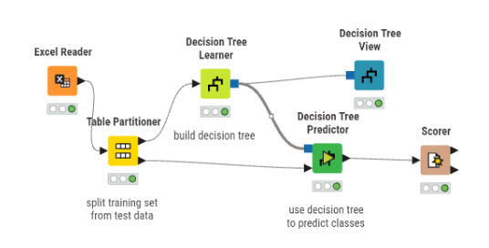
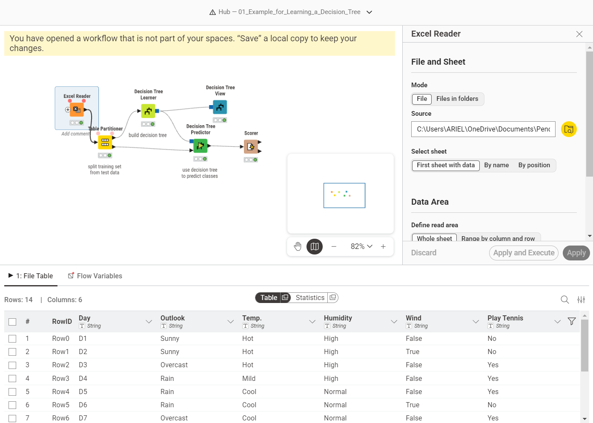
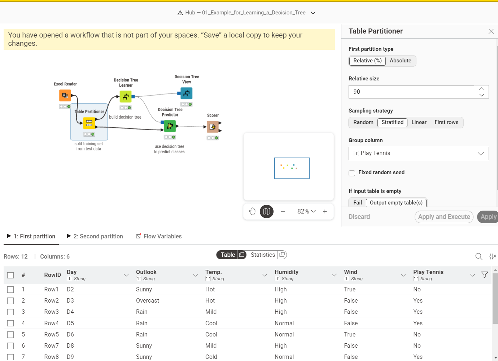
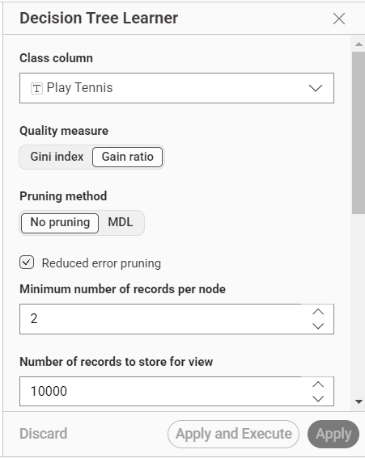
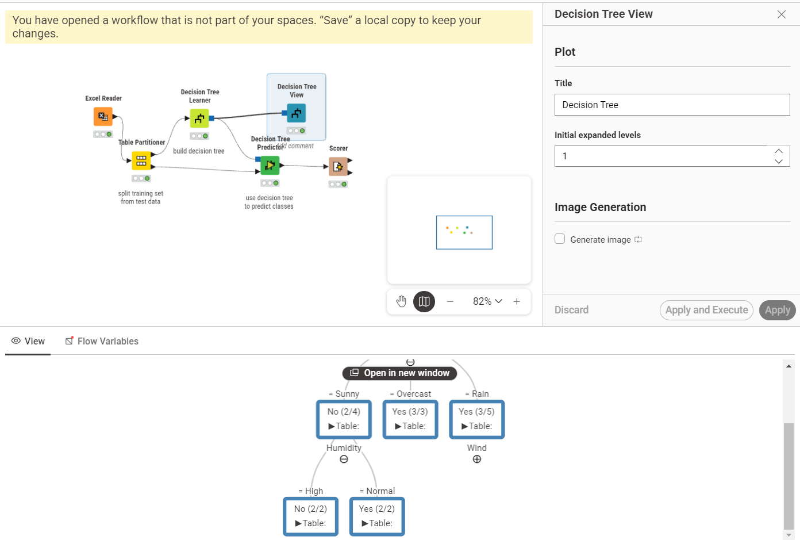
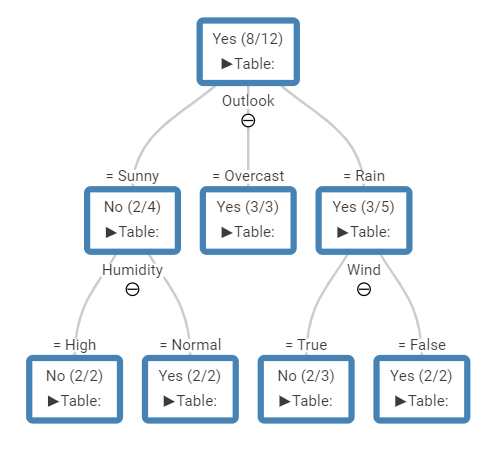

# Decision Tree 
## Tugas Gain Ratio

Gain Ratio menormalkan Information Gain dengan membaginya menggunakan **Split Information** untuk menghindari bias pada atribut yang memiliki banyak cabang/nilai unik.
 
Berikut adalah demonstrasi perhitungan untuk penentuan **Root Node (Node Akar)** menggunakan dataset **Play Tennis** yang berjumlah **14 instans data** (9 Yes, 5 No).
 
Data awal bersumber dari file Excel yang berisi histori kondisi cuaca dan keputusan bermain tenis. Di dalam dataset ini terdapat 14 baris rekaman dengan atribut prediktor: Outlook, Temp., Humidity, dan Wind, serta satu atribut target yaitu Play Tennis.

| # | Outlook | Temp. | Humidity | Wind | Play Tennis |
|---:|:---|:---|:---|:---|:---|
| 0 | Sunny | Hot | High | False | No |
| 1 | Sunny | Hot | High | True | No |
| 2 | Overcast | Hot | High | False | Yes |
| 3 | Rain | Mild | High | False | Yes |
| 4 | Rain | Cool | Normal | False | Yes |
| 5 | Rain | Cool | Normal | True | No |
| 6 | Overcast | Cool | Normal | True | Yes |
| 7 | Sunny | Mild | High | False | No |
| 8 | Sunny | Cold | Normal | False | Yes |
| 9 | Rain | Mild | Normal | False | Yes |
| 10 | Sunny | Mild | Normal | True | Yes |
| 11 | Overcast | Mild | High | True | Yes |
| 12 | Overcast | Hot | Normal | False | Yes |
| 13 | Rain | Mild | High | True | No |

> Dataset yang digunakan [Download Play_Tennis_Dataset.xlsx](./.xlsx) 
---

## A. Menghitung Total Entropy Dataset
 
Langkah pertama adalah menghitung ketidakpastian *(Entropy)* dari keseluruhan data target (Play Tennis).
 
**Rumus Entropy:**
 
$$Entropy(S) = \sum_{i=1}^{n} -p_i \log_2 (p_i)$$
 
**Perhitungan:**
 
- Total Data ($S$) = 14
- Kasus "Yes" ($S_{yes}$) = 9
- Kasus "No" ($S_{no}$) = 5
$$Entropy(Total) = - \left(\frac{9}{14}\right) \log_2 \left(\frac{9}{14}\right) - \left(\frac{5}{14}\right) \log_2 \left(\frac{5}{14}\right)$$
 
$$\boxed{Entropy(Total) = 0.940}$$
 
---
 
## B. Menghitung Information Gain pada Atribut (Contoh: Outlook)
 
Selanjutnya, kita menghitung **Information Gain** untuk atribut **Outlook**. Atribut ini memiliki 3 nilai: **Sunny** (5 data), **Overcast** (4 data), dan **Rain** (5 data).
 
### Entropy Masing-Masing Cabang Outlook
 
**Sunny** (2 Yes, 3 No):
 
$$Entropy(Sunny) = - \left(\frac{2}{5}\right) \log_2 \left(\frac{2}{5}\right) - \left(\frac{3}{5}\right) \log_2 \left(\frac{3}{5}\right) = 0.971$$
 
**Overcast** (4 Yes, 0 No):
 
$$Entropy(Overcast) = - \left(\frac{4}{4}\right) \log_2 \left(\frac{4}{4}\right) - 0 = 0$$
 
**Rain** (3 Yes, 2 No):
 
$$Entropy(Rain) = - \left(\frac{3}{5}\right) \log_2 \left(\frac{3}{5}\right) - \left(\frac{2}{5}\right) \log_2 \left(\frac{2}{5}\right) = 0.971$$
 
### Rumus Information Gain
 
$$Gain(S, A) = Entropy(S) - \sum_{v \in Values(A)} \frac{|S_v|}{|S|} \cdot Entropy(S_v)$$
 
### Perhitungan Gain untuk Outlook
 
$$Gain(Outlook) = 0.940 - \left( \frac{5}{14} \times 0.971 + \frac{4}{14} \times 0 + \frac{5}{14} \times 0.971 \right)$$
 
$$\boxed{Gain(Outlook) = 0.940 - 0.693 = 0.247}$$
 
---
 
## C. Menghitung Split Information (Outlook)
 
C4.5 menghitung **Split Information** untuk melihat seberapa luas penyebaran data pada atribut tersebut.
 
**Rumus Split Information:**
 
$$SplitInfo(S, A) = - \sum_{i=1}^{c} \frac{|S_i|}{|S|} \log_2 \left(\frac{|S_i|}{|S|}\right)$$
 
**Perhitungan Split Info untuk Outlook:**
 
$$SplitInfo(Outlook) = - \left(\frac{5}{14}\right) \log_2 \left(\frac{5}{14}\right) - \left(\frac{4}{14}\right) \log_2 \left(\frac{4}{14}\right) - \left(\frac{5}{14}\right) \log_2 \left(\frac{5}{14}\right)$$
 
$$\boxed{SplitInfo(Outlook) = 1.577}$$
 
---
 
## D. Menghitung Gain Ratio (Outlook)
 
Tahap akhir adalah membagi Information Gain dengan Split Information.
 
**Rumus Gain Ratio:**
 
$$GainRatio(A) = \frac{Gain(A)}{SplitInfo(A)}$$
 
**Perhitungan Gain Ratio untuk Outlook:**
 
$$GainRatio(Outlook) = \frac{0.247}{1.577}$$
 
$$\boxed{GainRatio(Outlook) = 0.156}$$
 
---
 
## Kesimpulan
 
Berdasarkan kalkulasi di atas — yang juga diulangi untuk atribut **Temperature**, **Humidity**, dan **Wind** — atribut **Outlook** memiliki nilai **Gain Ratio tertinggi**. Oleh karena itu, secara matematis **Outlook terpilih sebagai Root Node** pada pohon keputusan.
 
## Implementasi Data ke KNIME

> Workflow di atas menunjukkan langkah-langkah yang saya lakukan untuk mengimplementasikan algoritma pohon keputusan dengan menggunakan Gain Ratio di dalam platform KNIME. Berikut penjelasan setiap tahapannya:
### Import Data ke KNIME

Pada KNIME, saya menggunakan node **Excel Reader** untuk mengimpor file data tersebut. Tampilan di atas adalah hasil pembacaan data. Saya mengecek kembali tipe datanya dan terlihat bahwa semua kolom bertipe String, yang memang sesuai mengingat seluruh variabelnya merupakan data kategorikal.

### Pembagian Data dengan Table Partitioner
 
Untuk melatih dan menguji model, saya perlu membagi data. Saya menggunakan node **Table Partitioner** untuk memecah dataset mentah menjadi dua bagian terpisah: data latih *(training set)* dan data uji *(test set)*. Data latih nantinya akan digunakan oleh algoritma untuk belajar, sedangkan data uji saya pakai untuk mengukur seberapa baik performa model yang sudah jadi.

### Pembelajaran Model dengan Decision Tree Learner
 
Data latih kemudian saya hubungkan ke node **Decision Tree Learner**. Di dalam node ini, model membaca pola dari atribut input dan secara rekursif memilih atribut dengan metrik pemisahan terbaik (misalnya metrik **Gain Ratio** pada algoritma C4.5) untuk membagi data. Hasil akhir dari pemrosesan node ini berupa model pohon keputusan.
 
### Visualisasi Pohon Keputusan

Untuk mengecek dan memahami logika yang dibuat oleh model, saya menambahkan node **Decision Tree View**. Node ini menerima output model yang sudah dilatih dan menampilkan grafis struktur pohon keputusannya. Melalui visualisasi interaktif tersebut, saya bisa melakukan penelusuran untuk melihat alasan pemilihan setiap percabangan dari akar *(root)* sampai ke daun *(leaf)*.
 
### Prediksi menggunakan Decision Tree Predictor
 
Setelah model selesai dilatih, langkah selanjutnya adalah menerapkannya ke data uji. Saya memakai node **Decision Tree Predictor** dengan memasukkan dua input: model pohon keputusan dan partisi data uji. Node ini akan mencocokkan setiap baris data uji ke dalam aturan model untuk menghasilkan sebuah prediksi baru.
 
### Hasil Pohon 
 
Hasil dari pohon keputusan yang dihasilkan oleh model dapat dilihat pada gambar di atas. Setiap node menunjukkan atribut yang digunakan untuk membagi data, sedangkan setiap cabang menunjukkan nilai atribut tersebut. Daun (leaf) menunjukkan kelas target yang diprediksi berdasarkan aturan yang terbentuk dari akar hingga ke daun tersebut.
 
### Evaluasi Akurasi dengan Scorer
 
Sebagai tahap akhir evaluasi, saya melampirkan node **Scorer** untuk mengukur seberapa akurat prediksi yang dihasilkan. Node ini mengambil data hasil prediksi, lalu membandingkan kolom kelas target asli dengan kelas prediksinya. Output akhirnya berupa nilai akurasi secara umum serta **confusion matrix** yang memudahkan saya mengetahui secara detail jumlah tebakan yang benar dan meleset.