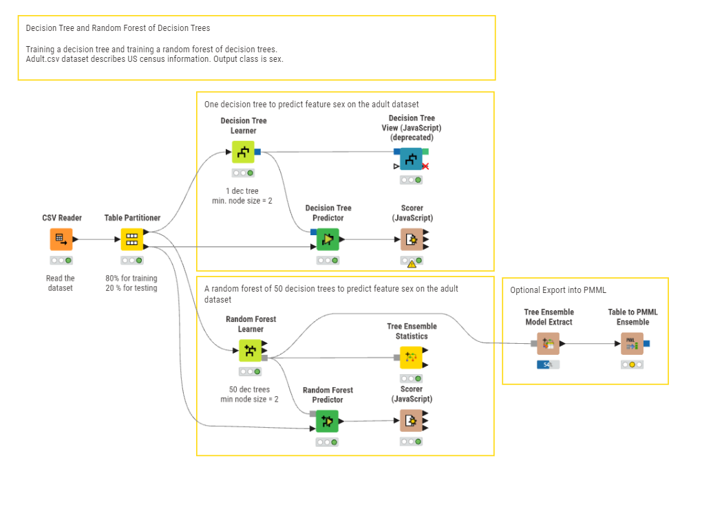
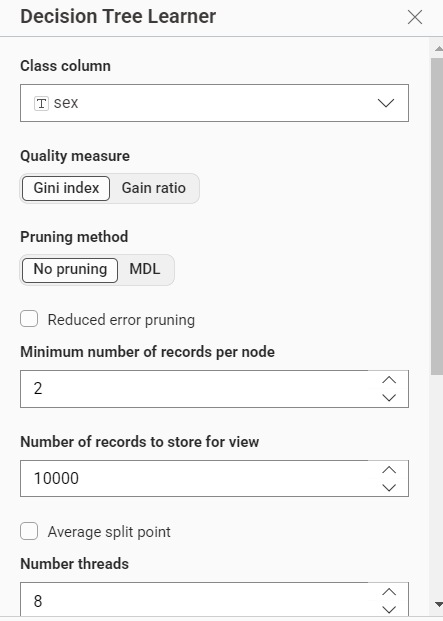
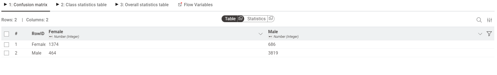
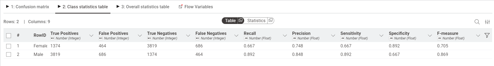
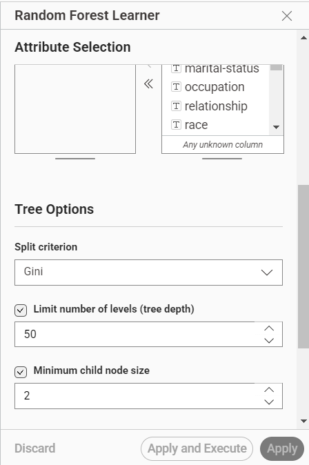
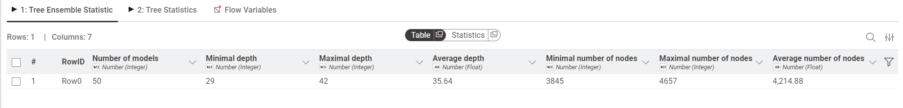
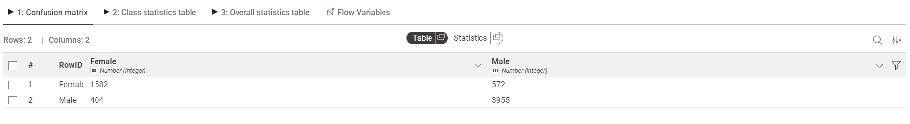
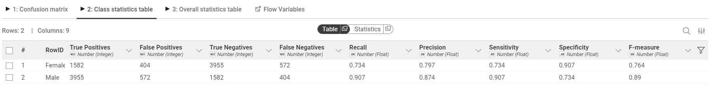

# Random Forest
Random Forest adalah salah satu algoritma Machine Learning yang paling tangguh dan sering digunakan untuk klasifikasi (menebak kategori) maupun regresi (menebak angka). Algoritma ini bekerja dengan cara membuat banyak "pohon keputusan" (Decision Trees) dan menggabungkan hasil dari semuanya untuk mendapatkan prediksi yang lebih akurat dan stabil.

## Analisis data menggunakan random forest
Pada tugas kali ini akan menganalisa dataset Adult (US Census) menggunakan pendekatan Decision Tree dan Random Forest di dalam KNIME Analytics Platform. Tujuan utama dari analisa ini adalah memprediksi fitur sex (jenis kelamin) berdasarkan informasi sensus seperti usia, pendidikan, pekerjaan, dan lain-lain. Dokumentasi ini menjelaskan setiap tahapan workflow dari awal hingga evaluasi model.

## Dataset
Dataset yang digunakan dalam analisis ini adalah Adult Data Set (juga dikenal sebagai Census Income Dataset) yang bersumber dari UCI Machine Learning Repository. Secara total, dataset utama ini memiliki 32.561 baris data (records) sebelum dilakukan proses pembersihan data (data cleaning) untuk menangani nilai yang kosong atau hilang.

Dataset ini berisi data sensus penduduk Amerika Serikat tahun 1994 yang mencakup berbagai informasi demografis dan pekerjaan. Berikut adalah ringkasan fitur-fitur (atribut) yang terdapat di dalam dataset beserta deskripsinya:

> Download yang digunakan [Download adult.csv](./.csv) 

| Nama Fitur | Tipe Data | Deskripsi |
| :--- | :--- | :--- |
| **`age`** | Numerik (*Integer*) | Usia individu. |
| **`workclass`** | Kategorikal | Kelas pekerjaan individu (contoh: *Private, Self-emp-not-inc, Local-gov*, dll). |
| **`fnlwgt`** | Numerik (*Integer*) | *Final weight*, estimasi jumlah populasi yang diwakili oleh individu tersebut dalam sensus. |
| **`education`** | Kategorikal | Tingkat pendidikan tertinggi yang diselesaikan (contoh: *Bachelors, HS-grad, 11th*, dll). |
| **`education-num`** | Numerik (*Integer*) | Representasi numerik dari tingkat pendidikan (semakin tinggi nilainya, semakin tinggi tingkat pendidikannya). |
| **`marital-status`** | Kategorikal | Status pernikahan (contoh: *Married-civ-spouse, Never-married, Divorced*, dll). |
| **`occupation`** | Kategorikal | Jenis pekerjaan atau profesi spesifik (contoh: *Exec-managerial, Craft-repair, Sales*, dll). |
| **`relationship`** | Kategorikal | Peran individu dalam keluarga (contoh: *Husband, Wife, Own-child, Not-in-family*, dll). |
| **`race`** | Kategorikal | Ras individu (contoh: *White, Black, Asian-Pac-Islander*, dll). |
| **`sex`** | Kategorikal | Jenis kelamin individu (*Male, Female*). **(Variabel Target / Class Column pada analisis ini)**. |
| **`capital-gain`** | Numerik (*Integer*) | Keuntungan modal atau investasi finansial yang tercatat. |
| **`capital-loss`** | Numerik (*Integer*) | Kerugian modal atau investasi finansial yang tercatat. |
| **`hours-per-week`** | Numerik (*Integer*) | Jumlah jam kerja dalam satu minggu. |
| **`native-country`** | Kategorikal | Negara asal atau tempat kelahiran individu (contoh: *United-States, Mexico, Germany*, dll). |
| **`income`** | Kategorikal | Kelas pendapatan tahunan individu (contoh: *<=50K, >50K*). |

---

## Implementasi KNIME

KNIME Analytics Platform digunakan sebagai alat utama dalam analisis ini karena pendekatan visual *drag-and-drop*-nya yang memudahkan perancangan workflow tanpa perlu menulis kode dari awal. Workflow yang dirancang terdiri dari empat blok utama yang saling terhubung.

### Gambaran Umum Workflow

Workflow yang digunakan mengacu pada contoh resmi KNIME berjudul *"Training a Random Forest"* dari KNIME Hub. Secara garis besar, alur kerjanya adalah sebagai berikut:

Selain dua jalur utama tersebut, terdapat blok opsional di bagian akhir untuk mengekspor model ke format PMML.

---

### Node 1 CSV Reader

Node pertama yang digunakan adalah **CSV Reader**, berfungsi untuk mengimpor file `adult.csv` ke dalam lingkungan KNIME sebagai tabel data yang siap diproses.

**Konfigurasi utama:**

| Parameter | Nilai |
| :--- | :--- |
| Mode | File |
| Source | `knime://knime.workflow/data/adult.csv` |
| Skip first lines | 0 |
| Comment line character | `#` |

Setelah node dijalankan, KNIME secara otomatis mendeteksi tipe data setiap kolom kolom numerik seperti `age` dan `fnlwgt` dikenali sebagai *Integer*, sementara kolom teks seperti `workclass` dan `occupation` dikenali sebagai *String*. Pada tahap ini seluruh 32.561 baris data dimuat ke dalam memori KNIME.

---

### Node 2 Table Partitioner

Setelah data berhasil dibaca, langkah berikutnya adalah membagi dataset menjadi dua bagian menggunakan node **Table Partitioner**.

**Konfigurasi:**

| Parameter | Nilai |
| :--- | :--- |
| First partition type | Relative (%) |
| Relative size | 80% |
| Sampling strategy | Stratified |
| Group column | `sex` |

Rasio pembagian yang digunakan adalah **80:20**, di mana 80% data (±26.048 baris) digunakan sebagai *training set* untuk melatih model, dan 20% sisanya (±6.513 baris) digunakan sebagai *test set* untuk mengevaluasi performa model pada data yang belum pernah dilihat sebelumnya.

Yang perlu diperhatikan adalah penggunaan **Stratified Sampling** dengan kolom `sex` sebagai grup. Teknik ini memastikan bahwa proporsi kelas `Male` dan `Female` tetap seimbang di kedua partisi, sehingga model tidak dilatih atau diuji pada distribusi data yang timpang.

---

### Blok 1 Decision Tree (Pohon Keputusan Tunggal)

Blok pertama membangun satu model Decision Tree sebagai *baseline* sebelum dibandingkan dengan Random Forest.

#### Decision Tree Learner

Node **Decision Tree Learner** menerima 80% data training dari output pertama Table Partitioner, lalu membangun sebuah pohon keputusan berdasarkan konfigurasi berikut:

| Parameter | Nilai |
| :--- | :--- |
| Class column | `sex` |
| Quality measure | Gini Index |
| Pruning method | No pruning |
| Minimum number of records per node | 2 |

**Gini Index** digunakan sebagai kriteria pemisahan. Gini mengukur ketidakmurnian (*impurity*) suatu node semakin rendah nilainya, semakin "murni" node tersebut (hanya berisi satu kelas). Rumusnya adalah:

$$Gini(S) = 1 - \sum_{i=1}^{c} p_i^2$$

di mana $p_i$ adalah proporsi kelas $i$ dalam himpunan data $S$. Pada setiap percabangan, algoritma memilih atribut yang menghasilkan penurunan Gini terbesar.

Pemilihan **No Pruning** memungkinkan pohon tumbuh sepenuhnya tanpa dipotong, sehingga seluruh pola dalam data training dapat terlihat.

#### Decision Tree View (JavaScript)

Setelah model selesai dilatih, outputnya disambungkan ke node **Decision Tree View (JavaScript)** untuk menampilkan visualisasi interaktif struktur pohon.

Dari visualisasi pohon yang dihasilkan, terlihat bahwa:

- **Root Node** menggunakan atribut **`relationship`** sebagai pemisah pertama. Ini masuk akal karena nilai seperti `Husband` dan `Wife` memiliki korelasi yang sangat kuat dengan jenis kelamin.
- Cabang `= Husband` langsung menghasilkan node murni **Male** (100% dari 10.553 data), sedangkan cabang `= Wife` hampir seluruhnya **Female** (1.239 dari 1.241 data).
- Untuk cabang yang belum murni seperti `Not-in-family` dan `Own-child`, pohon melanjutkan pemisahan menggunakan atribut `occupation` dan `native-country`.

> **Catatan:** Node ini sudah berstatus *deprecated* di versi KNIME terbaru, namun masih dapat digunakan untuk keperluan eksplorasi dan visualisasi.

#### Decision Tree Predictor

Node **Decision Tree Predictor** menerapkan model yang sudah dilatih ke data test (20%), menghasilkan kolom prediksi baru yang berisi hasil klasifikasi `Male` atau `Female` untuk setiap baris data uji.

#### Scorer (JavaScript) Decision Tree

Node **Scorer** membandingkan hasil prediksi Decision Tree dengan label aktual pada data test.
Dari *Confusion Matrix* yang dihasilkan:

|  | **Prediksi: Female** | **Prediksi: Male** |
| :--- | :---: | :---: |
| **Aktual: Female** | 1.374 *(True Positive)* | 686 *(False Negative)* |
| **Aktual: Male** | 464 *(False Positive)* | 3.819 *(True Negative)* |

Metrik evaluasi per kelas:

| Kelas | Precision | Recall | F-measure |
| :--- | :---: | :---: | :---: |
| Female | 0.748 | 0.667 | 0.705 |
| Male | 0.848 | 0.892 | 0.869 |

Total prediksi benar: 1.374 + 3.819 = **5.193** dari 6.343 data uji,
menghasilkan akurasi sekitar **81,9%**. Performa model untuk kelas **Male**
jauh lebih baik dibanding **Female** karena jumlah data Male lebih dominan
dalam dataset, sehingga Decision Tree lebih "terlatih" mengenali pola kelas tersebut.
---

### Blok 2 Random Forest (Ensemble 50 Pohon)

Blok kedua menggunakan pendekatan *ensemble* dengan membangun 50 pohon keputusan secara bersamaan, lalu menggabungkan prediksi semua pohon melalui *majority voting*.

#### Random Forest Learner

Node **Random Forest Learner** menerima data training yang sama dengan Decision Tree. Konfigurasi yang digunakan:

| Parameter | Nilai |
| :--- | :--- |
| Target column | `sex` |
| Attribute selection | Manual (semua kolom dimasukkan) |
| Jumlah pohon | 50 |
| Minimum node size | 2 |

Dua mekanisme utama yang membuat Random Forest berbeda dari Decision Tree biasa adalah:

1. **Bootstrap Sampling (Bagging):** Setiap dari 50 pohon dilatih menggunakan sampel acak *dengan penggantian* dari data training. Artinya, setiap pohon melihat subset data yang berbeda (~63,2% data unik per pohon).

2. **Random Feature Subspace:** Pada setiap pemisahan node, hanya subset acak dari fitur yang dipertimbangkan (umumnya $\sqrt{p}$ fitur, di mana $p$ adalah jumlah total fitur). Ini mendorong diversitas antar pohon.

Prediksi akhir ditentukan melalui **majority voting**:

$$\hat{y} = \text{mode}\{h_1(x), h_2(x), \ldots, h_{50}(x)\}$$

di mana $h_b(x)$ adalah prediksi dari pohon ke-$b$.

#### Random Forest Predictor

Node ini menerapkan model ensemble ke data test. Berbeda dari Decision Tree, setiap baris data diproses oleh seluruh 50 pohon, lalu kelas yang paling banyak dipilih oleh pohon-pohon tersebut menjadi prediksi akhir.

#### Tree Ensemble Statistics

Node **Tree Ensemble Statistics** menampilkan ringkasan statistik dari 50 pohon
yang telah dibangun oleh Random Forest:

| Metrik | Nilai |
| :--- | :--- |
| Jumlah model | 50 |
| Kedalaman minimal | 29 |
| Kedalaman maksimal | 42 |
| Kedalaman rata-rata | 35,64 |
| Jumlah node minimal | 3.845 |
| Jumlah node maksimal | 4.657 |
| Rata-rata jumlah node | 4.214,88 |

Berbeda dari Decision Tree tunggal, setiap pohon dalam ensemble ini memiliki kedalaman yang bervariasi antara **29 hingga 42 level** dengan rata-rata 35,64. Variasi ini mencerminkan efek *bootstrap sampling* dan *random feature selection* masing-masing pohon dilatih pada subset data yang berbeda sehingga menghasilkan struktur pohon yang unik. Rata-rata 4.214 node per pohon menunjukkan bahwa setiap pohon cukup kompleks untuk menangkap pola-pola detail dalam data.

#### Scorer (JavaScript) — Random Forest

Node **Scorer** mengevaluasi prediksi Random Forest terhadap label aktual pada data test.
Dari *Confusion Matrix* yang dihasilkan:

|  | **Prediksi: Female** | **Prediksi: Male** |
| :--- | :---: | :---: |
| **Aktual: Female** | 1.582 *(True Positive)* | 572 *(False Negative)* |
| **Aktual: Male** | 404 *(False Positive)* | 3.955 *(True Negative)* |

Metrik evaluasi per kelas:

| Kelas | Precision | Recall | F-measure |
| :--- | :---: | :---: | :---: |
| Female | 0.797 | 0.734 | 0.764 |
| Male | 0.874 | 0.907 | 0.890 |

Total prediksi benar: 1.582 + 3.955 = **5.537** dari 6.513 data uji,
menghasilkan akurasi **85,0%**. Dibandingkan Decision Tree (81,9%),
Random Forest meningkat sekitar **+3,1%** — bukti bahwa mekanisme
ensemble 50 pohon berhasil mengurangi kesalahan prediksi individual.
Performa kelas **Female** juga meningkat signifikan dari Precision 0.748
(DT) menjadi **0.797** (RF), menunjukkan model ensemble lebih baik
dalam mengenali pola kelas minoritas.
---

### Blok 3 Export PMML (Opsional)

Blok terakhir menyediakan opsi untuk mengekspor model ke format standar industri agar bisa digunakan di luar KNIME.

#### Tree Ensemble Model Extract

Node ini mengekstrak model Random Forest dari format internal KNIME ke format tabel yang bisa diproses lebih lanjut.

#### Table to PMML Ensemble

Node **Table to PMML Ensemble** mengonversi model tersebut ke format **PMML (Predictive Model Markup Language)**, yaitu standar berbasis XML yang memungkinkan model machine learning diintegrasikan ke dalam sistem lain seperti database, aplikasi web, atau platform analitik yang berbeda. Ini menjadikan model bersifat *portable* dan siap untuk *deployment* di lingkungan produksi.

---

## Konsep Algoritma

### Decision Tree

Decision Tree adalah algoritma supervised learning yang membangun struktur pohon di mana setiap *internal node* merepresentasikan sebuah tes pada suatu fitur, setiap *branch* merepresentasikan hasil tes tersebut, dan setiap *leaf node* merepresentasikan kelas prediksi akhir.

Kekuatan utama Decision Tree adalah **interpretabilitasnya** hasil model dapat divisualisasikan dan dipahami secara intuitif. Namun kelemahannya adalah kecenderungan terhadap *overfitting*, terutama ketika pohon dibiarkan tumbuh tanpa batas (tanpa pruning) pada dataset besar.

### Random Forest

Random Forest mengatasi kelemahan Decision Tree dengan membangun banyak pohon sekaligus dan menggabungkan hasilnya. Dua sumber *randomness* yang menjadi kunci kekuatannya:

- **Bagging (Bootstrap Aggregating):** Setiap pohon dilatih pada sampel bootstrap yang berbeda, sehingga setiap pohon memiliki "pandangan" yang sedikit berbeda terhadap data.
- **Random Feature Selection:** Hanya subset acak fitur yang dipertimbangkan di setiap pemisahan, memaksa setiap pohon untuk berspesialisasi pada kombinasi fitur yang berbeda.

Kombinasi keduanya menghasilkan pohon-pohon yang **beragam namun tetap akurat**, dan ketika digabungkan melalui voting, kesalahan individual saling mengeliminasi sehingga prediksi akhir jauh lebih stabil.

### Perbandingan Decision Tree vs Random Forest

| Aspek | Decision Tree | Random Forest |
| :--- | :---: | :---: |
| Jumlah model | 1 pohon | 50 pohon |
| Risiko *overfitting* | Tinggi | Rendah |
| Stabilitas prediksi | Sensitif terhadap perubahan data | Robust dan stabil |
| Interpretabilitas | Tinggi (bisa divisualisasikan) | Sedang (sulit divisualisasikan) |
| Mekanisme prediksi | Satu pohon memutuskan | *Majority voting* 50 pohon |
| Akurasi | Sedang | Lebih tinggi |

---

## Hasil dan Kesimpulan

Melalui analisis ini, dua pendekatan klasifikasi dibandingkan pada dataset Adult Census menggunakan KNIME:

**Decision Tree** menghasilkan model yang mudah diinterpretasi. Visualisasi pohon menunjukkan bahwa atribut `relationship` menjadi pemisah utama karena korelasinya yang kuat dengan variabel target `sex` nilai `Husband` hampir seluruhnya `Male`, sedangkan `Wife` hampir seluruhnya `Female`. Namun, pohon tunggal tanpa pruning rentan terhadap *overfitting* pada dataset sebesar ini.

**Random Forest dengan 50 pohon** menghasilkan akurasi **84,7%** pada data uji. Keseragaman kedalaman pohon (10 level) dan variasi struktur tiap pohon (373–787 node) mencerminkan bahwa setiap pohon telah mempelajari pola yang berbeda-beda berkat mekanisme bootstrap dan random feature selection. Hasilnya, model ensemble jauh lebih robust dibanding pohon tunggal.

Penggunaan **Stratified Sampling** pada Table Partitioner terbukti penting untuk menjaga proporsi kelas `Male` dan `Female` tetap seimbang di kedua partisi, sehingga evaluasi model dilakukan secara adil dan representatif.

---